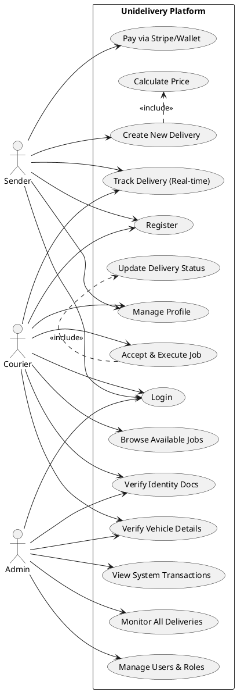

# 🚚 Unidelivery - Enterprise Delivery Management Platform

[](https://angular.io/)
[](https://ngrx.io/)
[](https://tailwindcss.com/)
[](https://stripe.com/)

**Unidelivery** is a cutting-edge, enterprise-level delivery management platform designed for seamless logistics operations. Built with a focus on scalability, performance, and user experience, it connects senders, couriers, and administrators in a unified, real-time ecosystem.

---

## ✨ Key Features

### 🏢 Admin Dashboard
*   **Comprehensive Logistics Overview:** Real-time monitoring of all deliveries and system health.
*   **User Management:** Centralized control over Admin, Courier, and Sender accounts.
*   **Vehicle Verification:** Automated and manual workflows for verifying courier documentation and vehicles.
*   **Financial Insights:** Detailed transaction logs and wallet management for the entire platform.

### 🛵 Courier Experience
*   **Available Jobs Feed:** Real-time job marketplace with geolocation-based filtering.
*   **Proof of Delivery:** Integrated document and identity verification system.
*   **Earnings Tracking:** Transparent wallet and transaction history.
*   **Vehicle Management:** Support for multiple vehicle profiles with verification status tracking.

### 📦 Sender Portal
*   **Seamless Ordering:** Intuitive "New Delivery" flow with automated price calculation.
*   **Real-time Tracking:** Map-based tracking for active deliveries using Leaflet integration.
*   **Wallet Integration:** Instant payments via Stripe or secure wallet-based transactions.
*   **Delivery History:** Detailed activity logs and receipt management.

### 🛠 Shared Core Capabilities
*   **💳 Stripe Payments:** Secure, PCI-compliant payment processing.
*   **🗺 Advanced Mapping:** Geolocation, routing, and address selection powered by Leaflet and OpenStreetMap.
*   **🔐 Robust Security:** JWT-based authentication with stateful role guards and interceptors.
*   **✅ Verification Engine:** Multi-stage identity and vehicle verification workflows.

---

## 🚀 Tech Stack

Unidelivery leverages a modern, high-performance tech stack to ensure reliability and speed:

*   **Framework:** [Angular 20+](https://angular.io/) - Utilizing the latest signals, standalone components, and optimized build system.
*   **State Management:** [NgRx 20+](https://ngrx.io/) - Global state handled via Actions, Reducers, Effects, and Selectors.
*   **Frontend UI:** Vanilla CSS + [Tailwind CSS 4.0](https://tailwindcss.com/) for rapid, modern styling.
*   **Animations:** [GSAP](https://greensock.com/gsap/) & [Lenis](https://lenis.darkroom.engineering/) for premium, smooth micro-interactions.
*   **Payments:** [Stripe JS](https://stripe.com/docs/js) for secure financial transactions.
*   **Mapping:** [Leaflet](https://leafletjs.com/) with Routing Machine and Geocoder for logistics operations.
*   **Icons:** [Lucide Angular](https://lucide.dev/) for clean, consistent iconography.

---

## 🏛 Project Architecture

This project follows a **Feature-Sliced Design (FSD)** inspired approach, ensuring high modularity and clear separation of concerns.

```text
src/app/
├── core/           # 🧩 Singletons, global guards, interceptors, and core services
│   ├── guards/     # Auth and Role-based access control
│   ├── interceptors/ # HTTP request/response manipulation (Auth, Error handling)
│   └── services/   # Global services (Geolocation, Theme, Toast, JWT)
├── features/       # 🚀 Domain-driven business modules
│   ├── auth/       # Login, Registration, and Password management
│   ├── admin/      # Management dashboards and verification flows
│   ├── courier/    # Job marketplace and vehicle management
│   ├── sender/     # Delivery creation and tracking
│   └── payment/    # Stripe integration and Wallet management
├── layouts/        # 🖼 Visual wrappers (Admin, Auth, and Main layouts)
└── shared/         # ♻ Reusable components and logic across features
```

### Separation of Concerns:
*   **Core:** Handles the "plumbing" of the application (Auth guards, HTTP interceptors, global models).
*   **Features:** Each feature is self-contained, isolating its business logic, UI components, and NgRx state.
*   **Layouts:** Dictates the high-level UI structure, allowing features to remain agnostic of the container.

---

## 📊 Business Logic & Use Cases

The following diagram illustrates the primary interactions and workflows for the three core roles in the Unidelivery ecosystem:



---

## 🧠 State Management (NgRx)

Unidelivery uses a feature-based state management strategy. Each major domain module has its own dedicated slice of state:

*   **Auth State:** Manages user session, JWT tokens, and user profile data.
*   **Delivery State:** Handles the lifecycle of a delivery (Created -> Picked Up -> Delivered).
*   **Admin State:** Manages system-wide data, user lists, and pending verifications.
*   **Wallet State:** Real-time updates for balance and transaction history.

*The state is debuggable via Redux DevTools, ensuring full transparency of application flow.*

---

## 🏁 Getting Started

### Prerequisites
*   **Node.js:** v20.x or higher
*   **NPM:** v10.x or higher
*   **Angular CLI:** `npm install -g @angular/cli`

### Installation
1. Clone the repository:
   ```bash
   git clone https://github.com/your-repo/unidelivery-frontend.git
   cd unidelivery-frontend
   ```
2. Install dependencies:
   ```bash
   npm install
   ```

### Running the App
Start the development server:
```bash
npm start
```
Navigate to `http://localhost:4200/`. The app will automatically reload if you change any of the source files.

---

## 🔑 Environment Variables

To run the application with full functionality, create a `./src/environments/environment.ts` (or use `.env` if configured) with the following placeholders:

```typescript
export const environment = {
  production: false,
  apiUrl: 'https://api.unidelivery.com/v1',
  stripePublicKey: 'pk_test_your_key_here',
  mapboxToken: 'your_mapbox_or_leaflet_token',
  environmentName: 'development'
};
```

---

## 🤝 Contributing

We welcome contributions! Please follow the standard Git branching model and ensure all PRs are linked to an issue.

1. Create a feature branch (`git checkout -b feature/AmazingFeature`)
2. Commit your changes (`git commit -m 'Add some AmazingFeature'`)
3. Push to the branch (`git push origin feature/AmazingFeature`)
4. Open a Pull Request

---

Developed with ❤️ for the future of delivery services.
